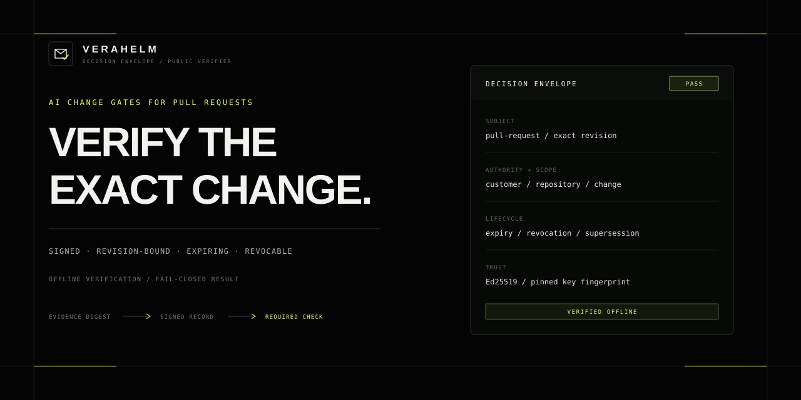

# Verahelm Decision Envelope

Verahelm verifies whether a signed authorization record is valid for the exact pull request or agent change under review.

## Five-minute quick start

Requires Git and Node.js 20 or later.

```bash
git clone --depth 1 https://github.com/Verahelm/verahelm-decision-envelope.git && cd verahelm-decision-envelope && node cli/verahelm.mjs demo
```

Expected fictional output:

```json
{"status":"demo_complete","results":[{"fixture":"pass","status":"pass"},{"fixture":"blocked","status":"blocked"},{"fixture":"expired","status":"expired"},{"fixture":"tampered","status":"tampered"}]}
```

Successful verification proves that a supplied fictional envelope matches the
published schema, signature, lifecycle, and expected bindings at verification
time. It does not prove the truth or quality of underlying evidence, authorize
production use, execute Verahelm's private engine, or discover a later
revocation without a sufficiently fresh signed status.



Test results, security findings, policy decisions, and review notes show what was
checked. They do not by themselves record who authorized a particular change,
the scope of that authorization, or when it expires.

Verahelm's hosted API can issue a signed Decision Envelope for an exact subject
version. The envelope records authority, scope, conditions, issuance, expiry,
revocation, and supersession in a portable object. The first supported workflow
is change gating for pull requests and agents; the API documents thirteen gate
profiles under the same contract.

The public contract accepts structured summaries and digests. It defines no
fields for repositories, source code, prompts, traces, files, datasets, or raw
records. The fictional quick start runs locally without network access after
the repository is cloned.

## Add the verifier to a pull request

```yaml
permissions:
  contents: read

steps:
  - uses: actions/checkout@3d3c42e5aac5ba805825da76410c181273ba90b1
  - name: Bind expected pull-request subject
    id: subject
    env:
      SUBJECT_ID: ${{ github.repository }}
      SUBJECT_REVISION: ${{ github.event.pull_request.head.sha }}
    run: printf 'version=sha256:%s\n' "$(printf '%s' \"$SUBJECT_ID@$SUBJECT_REVISION\" | sha256sum | cut -d' ' -f1)" >> "$GITHUB_OUTPUT"
  - uses: Verahelm/verahelm-decision-envelope@687404bc44b72cac09c0ad1e5bc196b7ae653baa
    with:
      envelope: path/to/decision-envelope.json
      public-key: path/to/public-key.pem
      public-key-sha256: ${{ vars.VERAHELM_PUBLIC_KEY_SHA256 }}
      subject-id: ${{ github.repository }}
      subject-version: ${{ steps.subject.outputs.version }}
      authority-id: ${{ vars.VERAHELM_AUTHORITY_ID }}
      scope-environment: ${{ vars.VERAHELM_SCOPE_ENVIRONMENT }}
      scope-change: pull-request-${{ github.event.pull_request.number }}
```

The Action verifies a supplied envelope; it does not call the hosted API or
issue a decision. Configure `VERAHELM_PUBLIC_KEY_SHA256` as a repository
Actions variable containing `sha256:` followed by the SHA-256 fingerprint of
the trusted key file. Pull-request content must not control this value.
Generate the value with `node cli/verahelm.mjs fingerprint PUBLIC_KEY`. Also
configure the expected authority and environment as protected repository
variables. The signed `scope.change` must match
`pull-request-<pull-request-number>`.
Use the complete base-controlled workflow in
[`template/verahelm-change-gate.yml`](template/verahelm-change-gate.yml); it
does not execute pull-request code.

For a gate that relies on current lifecycle status, supply a signed status file
and `status-max-age-seconds`. Without a sufficiently fresh status, offline
verification cannot discover a later server-side revocation or supersession.
The Action matches expected subject, version, authority, environment, and
change. The consuming workflow must still enforce every signed condition.

## Local commands

```bash
node cli/verahelm.mjs demo
node cli/verahelm.mjs validate fixtures/pass.json
node cli/verahelm.mjs verify fixtures/pass.json --key fixtures/fixture-public-key.pem
node cli/verahelm.mjs explain fixtures/pass.json
node cli/verahelm.mjs fingerprint fixtures/fixture-public-key.pem
```

All five commands run without network or subprocess access. Command behavior and
exit codes are documented in [docs/CLI.md](docs/CLI.md).

## Result handling

A valid pass envelope exits zero. Blocked, expired, revoked, superseded, and
tampered envelopes exit nonzero. An optional expected subject and version bind
verification to the pull request under review. The public demonstration shows
an intentionally
[blocked pull request](https://github.com/Verahelm/verahelm-decision-envelope-demo/pull/1)
and an intentionally
[passing pull request](https://github.com/Verahelm/verahelm-decision-envelope-demo/pull/2).
Both use prebuilt fictional envelopes and a base-controlled workflow; neither
result came from the private engine. The
[local explanation](demo-pr/README.md) describes the same lifecycle transition.

## Hosted API profiles

The hosted API groups pull-request gating, agent-change gating, tool admission,
migration readiness, retesting, failure coverage, and related checks under one
contract. Inputs are caller-supplied summaries. Verahelm does not represent that
caller-supplied evidence as independently verified and does not issue
certification, compliance approval, safety findings, or production authorization.

## Role in the toolchain

Evaluation, observability, security, governance, policy, provenance, and
repository tools produce evidence. Verahelm records how selected evidence is
bound to a subject version, customer authority, scope, conditions, and lifecycle.
The [sourced comparison](docs/COMPARISON.md) describes the boundary between
these jobs.

## Published components

This repository contains the public schemas, offline verifier, verification-only
GitHub Action, fictional fixtures, and conformance tests. It does not contain
Verahelm's hosted decision engine or its private implementation.

Do not submit source code, prompts, outputs, logs, datasets, credentials,
personal data, customer material, or third-party confidential information.
See [PRIVACY_BOUNDARY.md](PRIVACY_BOUNDARY.md).

## Verifier properties

- Ed25519 verification runs offline.
- The Action requires only `contents: read`.
- A trusted key fingerprint outside pull-request content prevents trust-key
  replacement. Signature verification and expected subject, authority, and
  scope matching reject payload modification and cross-context substitution.
- Unknown fields, unsupported versions, invalid signatures, and invalid
  lifecycle states fail closed.
- Fixtures are fictional and test only the published verification contract.
- The release manifest rejects unlisted files and repository history.

## Pricing

| Plan | Price | Included units | Limits |
|---|---|---|---|
| Developer | $49/month | 60/month; 10/day | 5 requests/10 seconds; 30/minute; concurrency 2; 1 key; 12,288 bytes; 6 seconds |
| Professional | $149/month | 300/month; 34/day | 13 requests/10 seconds; 90/minute; concurrency 5; 5 keys; 16,384 bytes; 8 seconds; metadata export |

Base profile cost is 1, 2, or 3 units. Each additional started 4,096-byte request
block adds one unit; boundary stress adds one unit per sample after the first.
Units do not roll over, and there is no automatic overage. Email support is best
effort with no response-time SLA.

## Documentation

- [API contract](https://www.verahelm.com/api-docs)
- [Request a non-production testing key](https://www.verahelm.com/access#testing-key)
- [Decision Envelope specification](SPECIFICATION.md)
- [GitHub Action contract](docs/ACTION.md)
- [Threat model](THREAT_MODEL.md)
- [Versioning policy](VERSIONING.md)
- [GitHub and attestation integration](docs/INTEGRATIONS.md#github-change-enforcement)

Reusable public code is licensed only as stated in [LICENSE](LICENSE).
